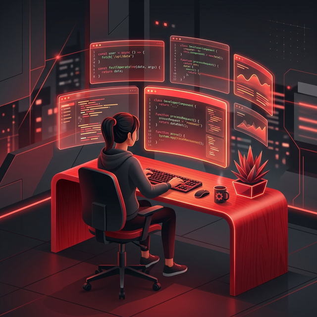

  

  

  
  
  
  

 

## Hi there 👋

I am Arfaa Taj, a multi-disciplinary engineer bridging the gap between **digital logic** and **physical action**. I'm also deeply passionate about robotics and IoT networks! 🤖🌐

> "Building the future, one line of code and one servo motor at a time."

 

### Hobbies 😆:

- Designing Autonomous Systems 🛸
- Securing Critical Infrastructure 🔐
- Deploying Scalable Cloud Backends ☁️
- Coding & Open Source Contributions 💻

 

---

---

## ⚡ Live Status

  
<b>🔭 What I am doing right now</b>

   

- **Working on:** Business process automation with Blue Prism and n8n workflows.
- **Collaborating on:** Integrating AI/ML services into intelligent automation agents.
- **Learning:** Agentic logic, error handling in data pipelines, and ROS2 Navigation Stack.

  
<b>🤝 How you can collaborate with me</b>

   

- Need help automating processes with Blue Prism or n8n.
- Building AI-integrated agentic workflows and fault-tolerant data pipelines.
- Looking for contributors in AI + hardware intersections.

---

## 🛠️ Technical Arsenal

### 🤖 Robotics and Automation

  
    
  
  
  

### 💻 Languages and Core

  

### 🌐 Web and Cloud

  

---

## 📊 GitHub Metrics & Activity

  
  

 

  
  <picture>
    <source media="(prefers-color-scheme: dark)" srcset="https://raw.githubusercontent.com/ArfaaTaj-savas/ArfaaTaj-savas/output/github-contribution-grid-snake-dark.svg">
    <source media="(prefers-color-scheme: light)" srcset="https://raw.githubusercontent.com/ArfaaTaj-savas/ArfaaTaj-savas/output/github-contribution-grid-snake.svg">
    
  </picture>

 

  

  

